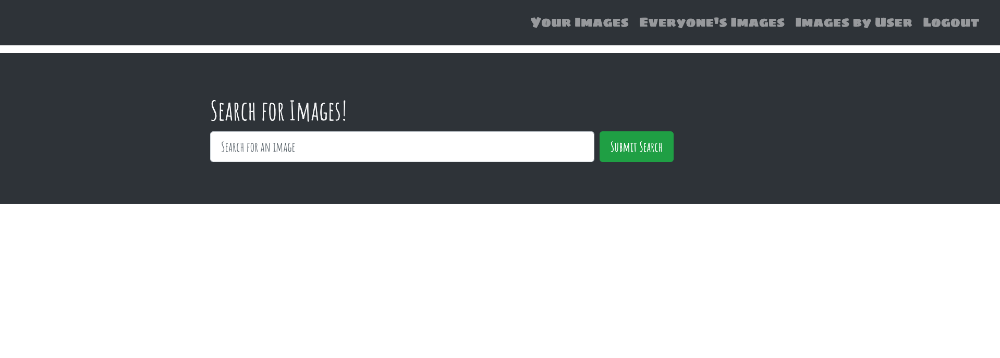
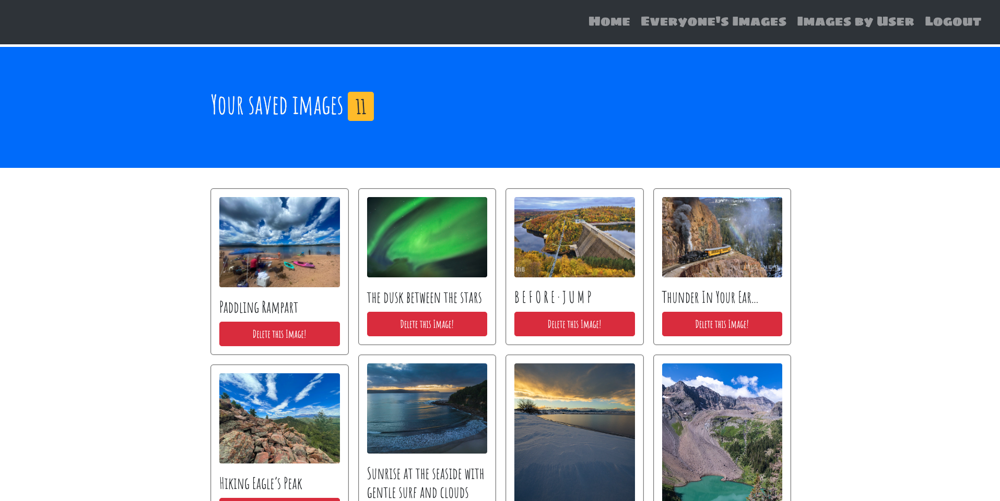
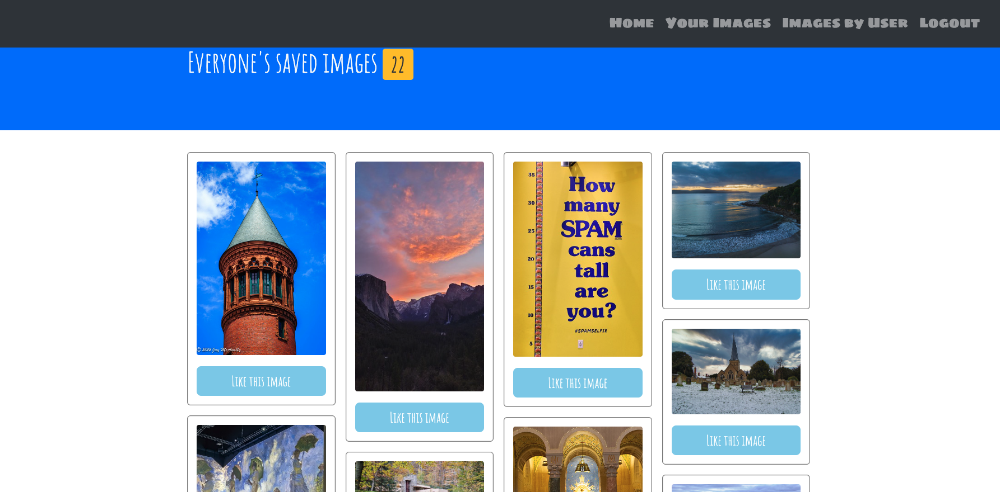
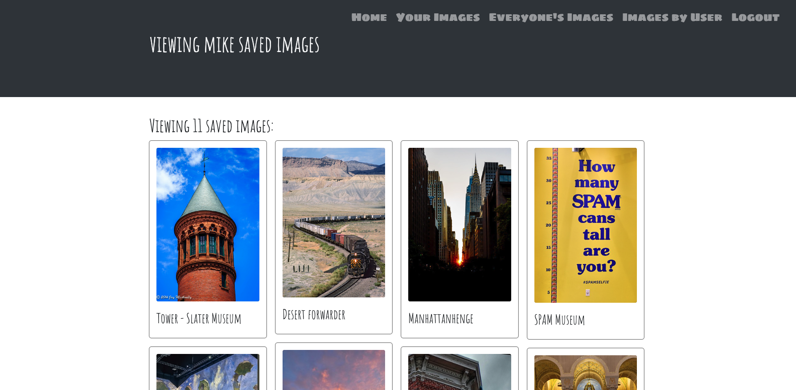
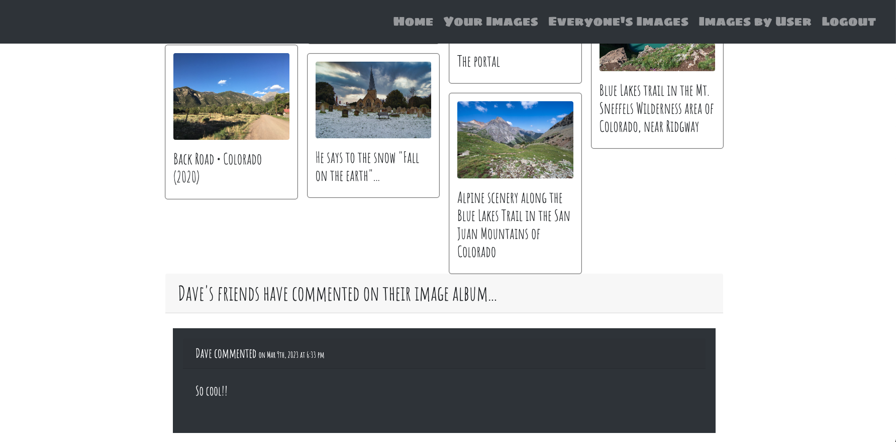
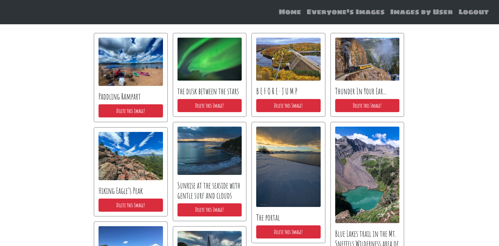
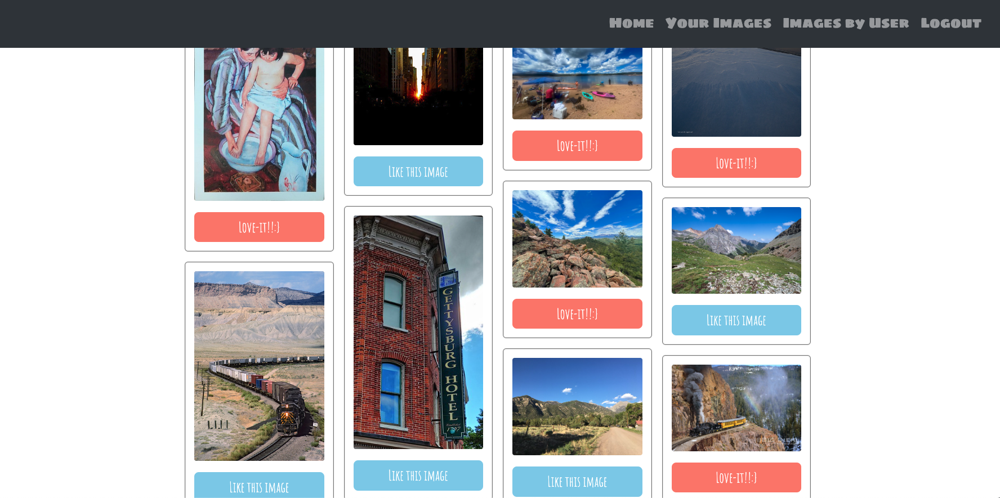

# Inspirations

Inspirations is a simple photo sharing app built with React and the Flickr API. Users can view photos, save them to their account after logging in or signing up. They can also delete photos from their account, view photos saved by other users, and like photos saved by other users.

## [Table Of Contents](#Table-Of-Contents)
- [Inspirations](#inspirations)
  - [Table Of Contents](#table-of-contents)
  - [Description](#description)
  - [Prerequisites](#prerequisites)
  - [Installation](#installation)
  - [User Information](#user-information)
  - [Features](#features)
  - [ScreenShots](#screenshots)
  - [License](#license)
  - [Credits](#credits)
  - [Links](#links)

## Description

This application was created after one of the developers told a story about a fabulous vacation
that she had taken.  It was to the Hawaiian Islands.  She was fascinated by the beaches in 
particular. She stated that the Hawaiian Islands are home to some of the most beautiful beaches in the world, with crystal-clear water, soft white sand, and gentle waves. Each island has its own unique beaches, from the popular Waikiki Beach on Oahu to the secluded Lanikai Beach on the island of Kauai.  After the story the group concluded that they would love to see the pictures.  From that conversation, the topic of a final project of our web-development 
bootcamp came up, and it was unanimous that we should create a photo-sharing app using React and an api from flickr.  This app allows the user to view photos that inspire, entertain and delight the users imagination!  When the page loads, the user has the option of logging in or signing up if they are new.  Once they login or signup, they can view, search and like photos from other users in the application.  Enjoy the journey!

## Prerequisites

To run this app, you will need:

<ul>
-Node.js and npm installed on your machine. 
-To clone the repository and install dependencies.
</ul>

## Installation

In the terminal and in the project directory, run:

`npm install`  *then*

`npm run develop`

Open [http://localhost:3000](http://localhost:3000) to view it in your browser.

You do need a Flickr API key to use this application.

To get a Flickr API key, follow these steps:

1. Go to the Flickr App Garden and sign in with your Flickr account.
2. Click the "Apply for Non-Commercial Key" button.
3. Fill out the form with the required information, including the name and description of your app, your  name, and your email address.
4. Read and agree to the Flickr API Terms of Service.
5. Click the "Submit" button.
   
Once your application is approved, you will receive a unique API key and secret that you can use to access Flickr's API.

To use the Flickr API in this app, you will need to authenticate this app using the API key and secret. You can find more information about the Flickr API, including authentication and usage guidelines, in the Flickr API documentation.

The page will reload when you make changes.\
You may also see any lint errors in the console.

## User Information

This photo sharing app is a software application that allows users to search, like, comment and share their photos with others. Here are some common ways people use photo sharing apps:

1. Social networking: People use photo sharing apps to share photos with their friends and family on social media platforms like Facebook, Instagram, and Snapchat. They can post photos of their everyday life, special events, and travels, and engage with others through comments and likes.

2. Professional photography: Professional photographers use photo sharing apps to showcase their work and build their portfolio. They can use the app to create albums of their photos, organize them by category or project, and share them with clients and other professionals in the industry.

3. Travel and adventure: People use photo sharing apps to document their travels and adventures, and to share their experiences with others. They can post photos of scenic locations, landmarks, and cultural experiences, and connect with other travelers and locals through their photos.

4. Memory keeping: People use photo sharing apps to create and store digital photo albums of their memories, such as weddings, birthdays, and other special occasions. They can add captions, dates, and other details to their photos, and use the app to keep track of their memories over time.

5. Marketing and branding: Businesses use photo sharing apps to promote their brand and products through visual content. They can post photos of their products, events, and promotions, and engage with their audience through comments and direct messages.

Overall, photo sharing apps are a versatile tool that can be used for a variety of purposes, from personal memory keeping to professional photography and marketing. They allow users to connect with others through visual content, and to share their experiences and creativity with the world.

## Features

**Search/View Images:**
* User can enter a description in the search bar to search for specific types of photos.

**Save Images:**
* User can save any of the images they searched for.

**See Your Inspiration**
* User can view saved images.

**Delete Images:**
* User can delete the images that they previously saved by hitting the delete button.

**See Everyone's Inspiration**
* User can see other users photos and like and comment on them.

## ScreenShots

**The Homepage**

**The user can view their saved images**

**Everyone's saved images view**

**Viewing another users images**

**The user may comment on other user's images**

**The user has the ability to delete their own images**

**The user can like other user's images!**

## License

MIT License

Copyright (c) [2023] [Dave Proto]

Permission is hereby granted, free of charge, to any person obtaining a copy
of this software and associated documentation files (the "Software"), to deal
in the Software without restriction, including without limitation the rights
to use, copy, modify, merge, publish, distribute, sublicense, and/or sell
copies of the Software, and to permit persons to whom the Software is
furnished to do so, subject to the following conditions:

The above copyright notice and this permission notice shall be included in all
copies or substantial portions of the Software.

THE SOFTWARE IS PROVIDED "AS IS", WITHOUT WARRANTY OF ANY KIND, EXPRESS OR
IMPLIED, INCLUDING BUT NOT LIMITED TO THE WARRANTIES OF MERCHANTABILITY,
FITNESS FOR A PARTICULAR PURPOSE AND NONINFRINGEMENT. IN NO EVENT SHALL THE
AUTHORS OR COPYRIGHT HOLDERS BE LIABLE FOR ANY CLAIM, DAMAGES OR OTHER
LIABILITY, WHETHER IN AN ACTION OF CONTRACT, TORT OR OTHERWISE, ARISING FROM,
OUT OF OR IN CONNECTION WITH THE SOFTWARE OR THE USE OR OTHER DEALINGS IN THE
SOFTWARE.

## Credits

This app was authored by:

1. [Lynn Sadler](https://github.com/lynnadelesadler)
2. [Ana Fede](https://github.com/anafede)
3. [Mike Johnson](https://github.com/mikewebprint)
4. [Scott George](https://github.com/ScottsC0de)
5. [Dave Proto](https://github.com/Dpro03)

## Links

GitHub  Repository:  https://github.com/ScottsC0de/proj-3

Website link:  https://af-ls-mj-sg-dp-proj-3.herokuapp.com/
